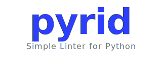

# 

# Simple Linter for Python

[](https://www.python.org/)
[](LICENSE)
[](https://docs.astral.sh/ruff/)
[](https://github.com/Khabib73/pyrid)
[](https://github.com/khabib73/pyrid/graphs/contributors/)


**pyrid** is a lightweight, extensible linter for Python that checks your codebase for common issues. It is designed to be simple to use, easy to configure, and straightforward to extend with custom checks.

---

## Table of Contents

- [Installation](#installation)
- [Usage](#usage)
  - [CLI](#cli)
  - [Flags](#flags)
  - [Configuration via `pyproject.toml`](#configuration-via-pyprojecttoml)
- [Rules](#rules)
- [Project Structure](#project-structure)
- [Development](#development)
- [CI/CD](#cicd)
- [License](#license)

---

## Installation

```bash
pip install pyrid
```

Or using [Poetry](https://python-poetry.org/):

```bash
poetry add --group dev pyrid
```

---

## Usage

### CLI

Run pyrid on a single file:

```bash
pyrid path/to/file.py
```

Run pyrid on an entire directory (scans all `.py` files recursively):

```bash
pyrid path/to/directory
```

Run pyrid on the current directory:

```bash
pyrid
```

### Flags

| Flag            | Description                                                      | Example                          |
|-----------------|------------------------------------------------------------------|----------------------------------|
| `--select`      | Enable specific rules or rule groups. All others are disabled.   | `pyrid --select D D101`          |
| `--ignore`      | Disable specific rules or rule groups. All others stay enabled.  | `pyrid --ignore D102 D103`       |

**Examples:**

```bash
# Run only docstring rules (group D)
pyrid --select D

# Run all rules except D102 and D103
pyrid --ignore D102 D103

# Run only D100 and D101
pyrid --select D100 D101
```

### Configuration via `pyproject.toml`

You can persist your rule selection in `pyproject.toml` under the `[tool.pyrid.lint]` section. CLI flags override the config file when both are provided.

```toml
[tool.pyrid.lint]
select = ["D"]
ignore = ["D102"]
```

This is equivalent to running:

```bash
pyrid --select D --ignore D102
```

---

## Rules

pyrid currently ships with the following rules:

| Code  | Name                          | Description                              |
|-------|-------------------------------|------------------------------------------|
| D100  | `missing-module-docstring`    | Module is missing a docstring            |
| D101  | `missing-class-docstring`     | Public class is missing a docstring      |
| D102  | `missing-method-docstring`    | Public method is missing a docstring     |
| D103  | `missing-function-docstring`  | Public function is missing a docstring   |

Rules are organised into **groups**. The group code is the letter prefix of the rule code:

| Group | Rules included       |
|-------|----------------------|
| D     | D100, D101, D102, D103 |

You can reference a group by its letter (e.g. `D`) in `--select` / `--ignore` and in the config file.

---

## Project Structure

```
pyrid/
├── src/
│   └── pyrid/
│       ├── __init__.py          # Package metadata (version, author)
│       ├── __main__.py          # CLI entry point (argparse)
│       ├── colors.py            # Terminal colour helpers
│       ├── config.py            # Load config from pyproject.toml
│       ├── rules.py             # Rule registry & resolution logic
│       ├── types.py             # Type aliases (FuncNode, FuncClassNode)
│       ├── utils.py             # File search & read utilities
│       └── docstring/
│           ├── __init__.py      # Exports docstring_checks
│           ├── checker.py       # AST visitor for docstring rules
│           ├── rules.py         # Individual docstring check functions
│           └── utils.py         # Error message formatting
├── tests/
│   ├── __init__.py
│   ├── conftest.py
│   ├── test_utils.py
│   └── docstring/
│       ├── __init__.py
│       └── test_docstring.py
├── pyproject.toml
├── Makefile
├── CHANGELOG.md
├── COMMIT_CONVENTIONS.md
├── LICENSE
├── README.md
└── TODO.md
```

### Key modules

| Module                          | Responsibility                                                |
|---------------------------------|---------------------------------------------------------------|
| [`src/pyrid/__main__.py`](src/pyrid/__main__.py) | CLI argument parsing, orchestration of checks                 |
| [`src/pyrid/config.py`](src/pyrid/config.py)     | Reads `[tool.pyrid.lint]` from `pyproject.toml`               |
| [`src/pyrid/rules.py`](src/pyrid/rules.py)       | Rule dataclass, `REGISTRY`, `GROUP_MAP`, `resolve_rules()`    |
| [`src/pyrid/docstring/checker.py`](src/pyrid/docstring/checker.py) | `DocstringVisitor` — AST walker that enforces D-rules |
| [`src/pyrid/docstring/rules.py`](src/pyrid/docstring/rules.py)     | Pure check functions (`check_d100` … `check_d103`)  |
| [`src/pyrid/utils.py`](src/pyrid/utils.py)       | `search_files()` and `read_code()` helpers                    |

---

## Development

### Prerequisites

- Python 3.14+
- [Poetry](https://python-poetry.org/)

### Setup

```bash
git clone https://github.com/Khabib73/pyrid.git
cd pyrid
poetry install
```

### Available commands

```bash
make lint        # Run ruff linter
make format      # Auto-fix imports & format code
make check_format # Check formatting without changes
make test        # Run pytest
make typecheck   # Run mypy type checker
```

### Adding a new rule

1. Create a check function in the appropriate module (e.g. [`src/pyrid/docstring/rules.py`](src/pyrid/docstring/rules.py)).
2. Register it in [`src/pyrid/rules.py`](src/pyrid/rules.py) by adding a [`Rule`](src/pyrid/rules.py:8) entry to `REGISTRY` and, optionally, to `GROUP_MAP`.
3. Wire the check into the appropriate visitor or checker module.

---

## CI/CD

This project uses **GitHub Actions** for continuous integration:

- **Ruff** — linting and formatting checks
- **Pytest** — test suite execution
- **Mypy** — static type checking

---

## License

Distributed under the MIT License. See [`LICENSE`](LICENSE) for more information.
